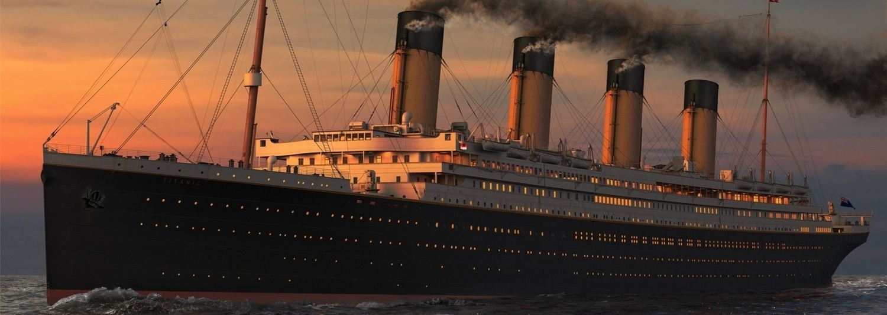

# Página Web del Viaje Inaugural del Titanic

¡Bienvenidos a la Página Web del Viaje Inaugural del Titanic!

## Descripción

Este repositorio contiene el código fuente y los recursos para una página web ficticia que promociona el histórico viaje inaugural del famoso barco Titanic. La página web está diseñada para revivir la emoción y el esplendor de aquel viaje de ensueño que capturó la imaginación de miles de personas. Y tambien aprobar con 10 el corso de Diseño Web en CoderHouse

## Características

- Diseño moderno y atractivo.
- Información detallada sobre el viaje del Titanic.
- Galería de imágenes del barco y su lujoso interior.
- Formulario de registro para interesados en el "Viaje del Siglo".

## Instalación

1. Clona este repositorio en tu máquina local.
2. Abre el archivo `index.html` en tu navegador web.

## Contribuciones

¡Todas las contribuciones son bienvenidas! Si tienes ideas para mejorar la página web o detectas errores, por favor crea un pull request.

## Autor

- Nombre: Agustin Neuman
- Contacto: agustin@neuman.com

## Licencia

Este proyecto se encuentra bajo la Licencia de White Star Line.
